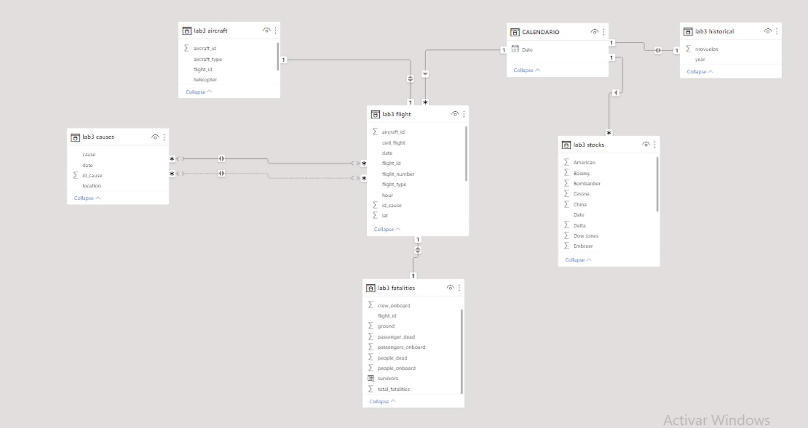

# Henry Lab 3 - Data Analytics
## Autor: Maico Bernal
### Contacto: bernalmaico@gmail.com

---

### Bienvenidos!

Este es el readme del proyecto nro 3 de proyectos individuales de Henry - enfocado en Data Analytics.

Pueden visualizar las consignas originales en el siguiente [link](https://github.com/soyHenry/PI03-Analytics) o en el archivo CONSIGNAS.md

---

### Objetivo:
Realizar un análisis y visualización de una base de datos de accidentes aéreos. 

### Metodología: 
#### 1) First sight: 

Se extrajo la información provista en el repositorio. La misma contiene datos de 5003 accidentes aéreos trágicos, donde se constata información del tipo de vuelo, aeronave, cantidad de tripulación y pasajeros, y víctimas fatales en aire y tierra; además de una descripción en texto libre de algunas características del evento.

#### 2) Deep dive en la temática: 

Con el objetivo de ahondar en el análisis y poder volcar la información en un dashboard se hizo un análisis de artículos de divulgación y periodísticos para analizar el problema y la temática.
El siguiente [artículo periodístico](https://samchui.com/2022/01/15/top-10-most-produced-commercial-aircraft-types/#.Y2qnCuwyG3I) sirvió de base para entender cuáles las aeronaves de uso civil de mayor volumen y que empresas se encargan de su fabricación. 

Se destacan como principales fabricantes mundiales: 

    *Boeing: empresa pública con cotización en la bolsa de NY.
    *Embraer: empresa pública brasileña
    *Cessna: la mayor empresa fabricante de aviones privados (con el Cessna 172 Skywalker como aeronave insignia). 
    *Bombardier: empresa canadiense que desde el año 2020 pertenece al grupo japonés Mitshubishi.
    *Antonov: empresa estatal que perteneció a la URSS, y en este momento pertenece a Ucrania.

### 3) Búsqueda de información adicional

A continuación, y para los fines de generar un análisis más profundo de la cuestión, se realizó la busqueda y ampliación de la información, extrayendo datos de las siguientes fuentes:

**a) [Banco Mundial:](https://datos.bancomundial.org/indicator/IS.AIR.DPRT?end=2020&start=1970&view=chart)** estadísticas globales de cantidad de vuelos por año -- Archivo './data/bm/API.csv'

**b) Yahoo Finance Historical Data**: Archivos localizados en carpeta *'./data/stock'*. Se eligió a las [10 aerolíneas públicas](https://en.wikipedia.org/wiki/Largest_airlines_in_the_world#By_company_revenue) que tienen mayor capitalización bursatil.

**c) [Plane Crash Info](http://www.planecrashinfo.com/index.html)**. De aquí se extrajo las causas documentadas de accidentes aéreos y los accidentes aéreos producto de alguna actividad militar (ya sea en combate o entrenamiento). 

#### 4) Normalización y limpieza de los datos
El siguiente paso fue la normalización y limpieza de los datos de accidentes aéreos. Se puede ahondar más en el tema en el *'notebook 1'*. 
Brevemente:
a) Normalización de datos
b) Cálculo de coordenadas GPS de cada ruta vía Geocoding API de Google. 
c) First sight del texto en *summary* con Wordcloud:

A simple vista no pareciera aportar información que amerite su procesamiento. 

d) Identifiación del país de origen de cada aeronave con libreria [Flydenity](https://github.com/Collen-Roller/flydenity) utilizando la codificación de la variable *registration*.

e) Web scrapping de los accidentes aéreos de causa militar y creación de feature binario *civil_flights*. 

f) Web scrapping de las causas documentadas de accidentes aéreos: creando un dataframe *causes* con uniqueID que identifique cada vuelo con su causa documentada (aves, sabotaje, falla técnica, etc). 

g) Como último, para mejor perfomance se dividió la tabla original en tablas más pequeñas: *fatalities, flights, aircrafts, causes* 

h) El procesamiento de los datos bursátiles se realizó en el *'notebook 2'* y se volcó en la tabla *stock*. El procesamiento de los datos del Banco Mundial se realizó en el *'notebook 3'* y se guardó en la tabla *historical*.

#### 5) Carga de datos a MySQL
Todos los datos procesados en estos 3 notebooks fue a posterior cargado en una base de datos en un servidor local de MySQL 8.0 vía SQLAlchemy y a continuación se realizó la conexión con PowerBI, quedando el siguiente modelo de datos: 

#### 6) Visualización y análisis en Power BI

Se puede visualizar en el archivo *dashboard.pbix*. El mismo consta de varias secciones donde se profundiza acerca de la temática. 

---

Son bienvenidos comentarios y sugerencias del proyecto!
Saludos, 